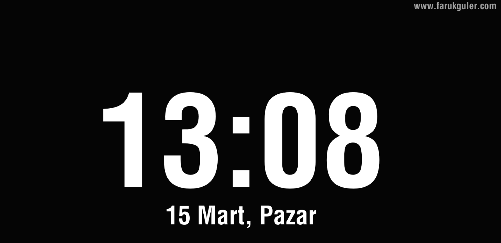

# OpenFliqlo - Profesyonel Ekran Koruyucu



Bu proje, Go ve Ebitengine kullanılarak geliştirilmiş, yüksek performanslı, açık kaynak ve minimalist bir Windows ekran koruyucusudur.

## Özellikler

- **Modern & Dengeli Tasarım:** Siyah arka plan üzerine net beyaz tipografi; saat, boşluk ve tarih tüm ekran çözünürlüklerinde matematiksel olarak dikey ve yatay merkezlenir.
- **Düşük Kaynak Tüketimi (Eco & Battery Friendly):** 30 TPS sınırlaması ve render önbelleklemesi (caching) sayesinde CPU ve GPU tüketimi asgariye indirilmiştir. Saniyede 60 kez gereksiz string üretilmez.
- **Yanlış Kapanma Koruması (Startup Grace Period):** İlk açılış anındaki mikro fare titreşimleri filtrelenerek ekran koruyucunun kazara hemen kapanması engellenir.
- **Türkiye Yerelleştirmesi:**
  - 24 saatlik veya 12 saatlik format seçeneği.
  - Türkçe tarih formatı (Örn: 23 Aralık, Cuma).
- **Kolay Kişiselleştirme (`config.json`):** Yeniden derlemeye gerek kalmadan aynı klasördeki `config.json` ile URL metnini, URL görünürlüğünü ve saat formatını değiştirebilme.
- **Windows Entegrasyonu:** Windows Ekran Koruyucu menüsünden "Ayarlar" (`/c`) tıklandığında bilgilendirici yerel Windows diyaloğu.
- **Windows Meta Verileri:** Dosya özelliklerinde sürüm, şirket ve açıklama bilgileri (`go-winres`).

## Yapılandırma (`config.json`)

Ekran koruyucunun yanına bir `config.json` dosyası bırakarak ayarları dilediğiniz gibi değiştirebilirsiniz:

```json
{
  "language": "auto",
  "url": "www.farukguler.com",
  "show_url": true,
  "show_year": true,
  "format_24h": true
}
```

- `"language"`: `"auto"` (Windows sistem dilini otomatik algılar), `"en"` (İngilizce: *Thursday, September 3, 2026*), `"tr"` (Türkçe: *3 Eylül 2026, Perşembe*).
- `"show_year"`: `true` (Yılı gösterir: *2026*), `false` (Yılı gizler).
- `"format_24h"`: `true` (24 saat biçimi: 15:04), `false` (12 saat biçimi: 03:04).
- `"show_url"`: `true` (Sağ üstteki URL'yi gösterir), `false` (URL alanını gizler).
- `"url"`: Sağ üstte gösterilecek özel metin veya web adresi.

### Yapılandırma Dosyası Konumları (Öncelik Sırası)

1. **Taşınabilir (Portable):** Ekran koruyucunun (`GoSaatVeTarih.scr`) bulunduğu klasördeki `config.json`.
2. **Kurumsal / GPO / Standart Kullanıcı:** `%APPDATA%\OpenFliqlo\config.json` (Uygulama `System32` içine kurulduğunda yetki sorunu yaşamadan kullanıcı bazlı özelleştirme sağlar).

> **İpucu:** Windows Ekran Koruyucu ayarlarından **"Ayarlar"** butonuna tıkladığınızda çıkan pencereden **"Evet"** diyerek `config.json` dosyasını Not Defteri ile doğrudan açıp düzenleyebilirsiniz.

*Not: Eğer `config.json` dosyası bulunamazsa ekran koruyucu otomatik olarak varsayılan ayarlarla sorunsuz çalışır.*

## Antivirüs Uyarıları Hakkında

Eğer bir "Virüs" veya "Bilinmeyen Yayıncı" uyarısı alıyorsanız, lütfen [VIRUS_NOTICE.md](VIRUS_NOTICE.md) dosyasını okuyun. Bu tamamen Go dilinin derleme yapısıyla ilgili hatalı bir alarmdır.

## Gereksinimler

- [Go](https://go.dev/dl/) 1.23 veya üzeri.
- Windows İşletim Sistemi.

## Derleme (Build)

Uygulamayı meta verileriyle birlikte derlemek için önce kaynak dosyasını oluşturun, ardından derleme yapın:

```powershell
# Kaynak dosyasını (.syso) oluştur / güncelle
go-winres make

# Uygulamayı derle
go build -ldflags="-s -w -H windowsgui" -o GoSaatVeTarih.scr .
```

**Bayrakların Açıklaması:**

- `-s -w`: Debug sembollerini siler, dosya boyutunu küçültür.
- `-H windowsgui`: Uygulama çalıştığında arkada boş bir terminal penceresi açılmasını engeller.
- `.scr` uzantısı: Windows'un dosyayı ekran koruyucu olarak tanımasını sağlar.

## Kullanım & Kurulum

1. `GoSaatVeTarih.scr` dosyasını oluşturun (veya mevcut olanı kullanın).
2. Dosyaya sağ tıklayın ve **Yükle (Install)** seçeneğini seçin.
3. Windows Ekran Koruyucu Ayarlarında "GoSaatVeTarih" olarak görünecektir.

## Kurumsal Dağıtım (GPO)

Kurumsal yapıda dağıtmak için projedeki `gpo.md` dosyasındaki adımları takip edebilirsiniz.

---
*Author:* faruk-guler - Apache Version 2.0
